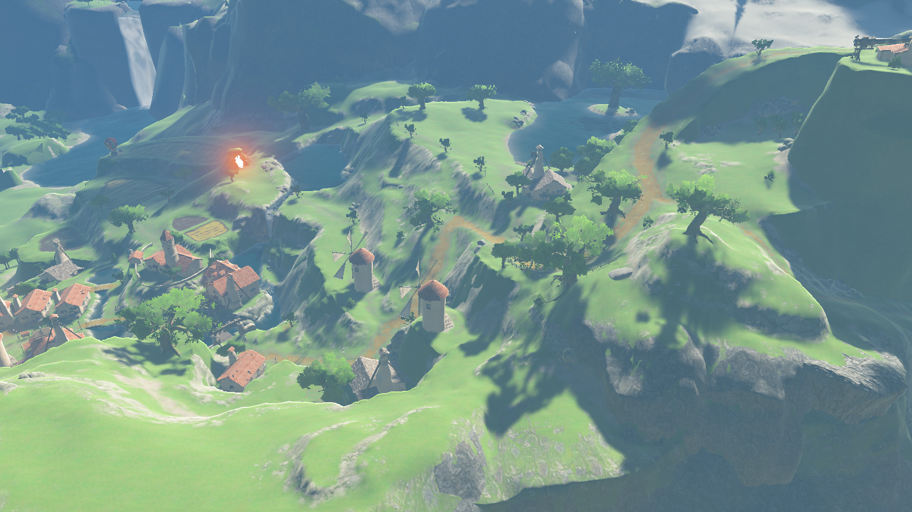
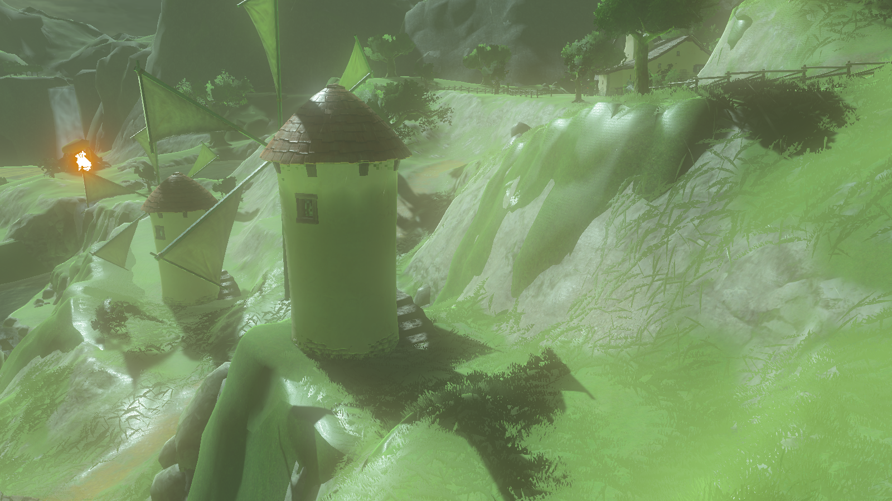
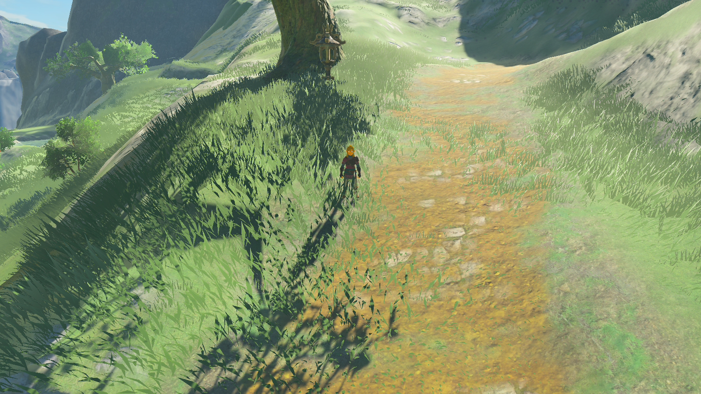

# botw renderer

An experimental **The Legend of Zelda: Breath of the Wild** world renderer built
with Rust and Bevy. World geometry, models, textures, skeletons and animation
clips come from your own game dump. Explore the world with a free camera and
preview character animations in the debug menu.

**Status as of October 4, 2026: working research prototype, version 0.1.0.**
Hateno is the main verified region. Rendering fidelity, effects and NPC assembly
remain incomplete.

## Quick start: bake the whole main map

Install Rust, a C/C++ toolchain and GPU drivers supported by Bevy/wgpu. Use
an extracted, decrypted **Wii U** game dump with update **1.5.0 / v208**.
See [requirements](#requirements) and [game dump layout](#required-rom--game-dump)
for details. Run the commands from the checkout root.

```bash
cargo fetch --locked
```

Create `renderer.toml` in the checkout root with your dump directories:

```toml
game_dirs = [
    "/path/to/botw-wiiu/base",
    "/path/to/botw-wiiu/update",
    "/path/to/botw-wiiu/dlc", # optional: remove if you have no DLC
]
```

Bake the **whole MainField map**, then launch the renderer:

```bash
cargo bake --region hateno --radius 12000
cargo render
```

`--radius` is the square's half-width in meters. A 12000 m half-width centered
on Hateno covers the entire main map. This prepares detailed assets for map-wide
exploration; it takes more time and disk space than a regional bake. The viewer
streams nearby terrain and objects rather than loading the whole map at once.
Hateno remains the main verified region for rendering fidelity.

The dump paths are layered **base → update → DLC**. Prepared assets go into
`assets/`. `renderer.toml` and `assets/` stay local and are excluded from Git.
`cargo bake` and `cargo render` use release builds; build output lives in `target/`.
Rebake after asset format or baker changes.

To pass paths directly instead of using `renderer.toml`:

```bash
cargo bake --game /path/to/botw-wiiu/base \
  --game /path/to/botw-wiiu/update --region hateno --radius 12000
cargo render
```

### Bake a specific region

For a smaller bake, choose a location marker and radius:

```bash
cargo bake --region hateno --radius 1000 --out assets-hateno
cargo render --assets assets-hateno --place hateno
```

`--region` accepts a name from the game's location markers, stored in
`places.ron` after baking. `--radius 1000` covers a 2 × 2 km square around that
marker. Use a separate output directory to keep regional and whole-map assets
apart. `assets-*` directories are git-ignored; keep other custom asset directories
outside Git. The bare `cargo bake` command
uses Hateno and a 1000 m radius; the quick start above explicitly selects the
whole map.

You can also expand detailed object/model coverage in an existing bake:

```bash
cargo bake --region hateno --radius 12000 --only objects,models,effects,elink
```

This updates object-dependent effects too. It does not expand terrain coverage;
use the complete bake command above to prepare the whole map. Increasing viewer
LOD distances cannot supply detailed models that have not been baked.

## Screenshots

Captured on October 4, 2026 at 1600 × 900 from local Hateno assets, without
diagnostic overlays. These show the current research prototype; rendering
fidelity and effects remain incomplete.

### Hateno Village

Clear weather at 10:00.



### Rain

Rain and wet surfaces at 16:00.



### Link

Native character materials and the looping `Nml_Wait` clip.



## Implemented

| Subsystem | Current state |
|---|---|
| Asset preparation | `bake` converts the dump into terrain, surface textures, objects, trees, grass, environment tables, water, effects and characters. Base game, update and DLC directories are layered in priority order. |
| World | Terrain and object streaming, LOD, near and distant trees, grass, a free camera and a debug menu. The quick start prepares the whole main map; smaller regional bakes are also supported. |
| Lighting | Game sky and environment tables, time of day, fog, clouds and cloud shadows, environment cube map, AO, emission, tone curve and bloom. Documented approximations remain. |
| Weather and effects | Particles, ELink, rain, snow, wet surfaces, thunderstorms and volume masks. Some families and playback conditions are incomplete. |
| Water and glass | Terrain water, translucent materials and waterfall families found around Hateno, with material animation. |
| Link | Skeleton and outfit, native clips, animation blending and facial animation. |
| NPCs | Experimental Hylian UMii assembly: body and face parts, materials and map placements. A verified bake contains 58 placements / 57 actors. Preview is opt-in through `--villagers`. |

## Not finished

- Complete UMii assembly and proportions: individual facial transforms, mouth geometry, head attachment, beard jaw forwarding, height and weight. Native tables are being read, but their complete application pipeline is not connected. Other races, Mii-based characters and the full NPC roster are unsupported.
- Full rendering fidelity: differences remain in shadows, character lighting, translucent passes, cube maps, the material combiner and some dynamic inputs. Materials and effects outside the verified region require further work.
- Every particle family and its native draw order, some CPU fields, stripe plugins, weather conditions and interactions. Cloud caps still need comparison with the original game.
- Verified rendering across the full map, all outfits, enemies and equipment. Player controls, combat and actor AI are outside the current renderer.


## Controls and examples

Camera controls: `WASD` moves, `Q/E` moves down/up, `Shift` speeds up, and the wheel changes speed. Hold the right mouse button to look around, or click the left button to capture the cursor. `Esc` releases it. Numbered viewpoints may lie outside the baked region.

The debug menu opens on startup. `F2` toggles it and `F1` toggles diagnostics. Change camera parameters, time, weather, climate, terrain/object/grass settings, post processing and character animation. The environment editor exposes all loaded palette and renderer fields, with search and reset. Experimental camera haze (`FieldEnvEffect`) is disabled by default.

Useful commands:

```bash
# Hold a specific time of day and weather.
cargo render --time 18:00 --weather rain

# Loop a Link animation; preview experimental villagers.
cargo render --character link --clip Nml_Move_Run
cargo render --villagers

# Save a view after the world loads, then exit.
mkdir -p captures
cargo render --time 10:00 --weather bluesky --screenshot captures/hateno.png

# Available options.
cargo bake --help
cargo render --help
```

## How it was built

Graphics formulas and behavior were recovered from game resources, Wii U v208
analysis in Ghidra, and shaders investigated through Cemu. The Rust/WGSL
implementation uses Bevy infrastructure. Unverified behavior and approximations
carry `SI-…` annotations. Full parity with the original game has not been
established. Research notes live in `docs/research/`.

```text
Your Wii U dump → bake / botw-formats → assets/ → render (Bevy)
```

| Directory | Purpose |
|---|---|
| `crates/botw-formats` | Game format readers used during baking. |
| `crates/asset-format` | Prepared asset formats: RON, GLB, textures and tables. |
| `crates/bake` | World, model and animation clip conversion. |
| `crates/render` | World renderer and character animation previews. |
| `docs/research/` | Rendering and game format research. |

## Required ROM / game dump

The verified input is **The Legend of Zelda: Breath of the Wild for Wii U, update 1.5.0 (title version v208)**, as an **extracted, decrypted game dump**. The local verified configuration uses the European base game `WUP-P-ALZP`, update v208 and DLC v80. Use this combination to reproduce the verified setup. Other regions and versions have not been separately verified; the loader does not enforce a version number.

The base game and update are required. DLC is an additional layer; remove its configuration entry if you do not have it. Recorded local results used DLC; a separate full run without it is not claimed here.

Files such as `.wud`, `.wux`, `.wua`, `.nsp`, `.xci`, archives and encrypted packages are not read directly. The loader expects directories such as `Terrain`, `Model` and `Pack` inside `content/`. It recognizes a Switch `romfs/` directory name, but that **does not establish Switch format support**. Use Wii U data.

Keep your dump outside this repository. The game, keys, prepared assets are not included; use a dump of your own copy. An emulator is not required to run this renderer.

Example layout:

```text
/path/to/botw-wiiu/
├── base/
│   └── content/
│       ├── Terrain/A/MainField.tscb
│       ├── Model/
│       ├── Pack/
│       └── Actor/
├── update/
│   └── content/
│       ├── Model/
│       └── Pack/
└── dlc/                      # optional
    └── content/0010/
        └── Pack/
```

Each `game_dirs` entry can point to the dump directory (`base/`), `content/` itself, or `content/0010/` for DLC. Order matters: **base → update → DLC**. Later directories override earlier ones.

## Requirements

- Rust and Cargo. The current verification uses **Rust 1.98.1**, edition 2024. Dependencies are pinned in `Cargo.lock`, including Bevy 0.19.1. A minimum Rust version has not been established separately.
- A system C/C++ toolchain and linker. On macOS, install Xcode Command Line Tools (`xcode-select --install`).
- A GPU and drivers supported by Bevy/wgpu, plus a graphical session. The main verified platform is macOS / Apple GPU. Linux and Windows have not been separately verified.
- Disk space for the dump, Rust build and prepared assets.

## Verification and troubleshooting

```bash
cargo test --locked --workspace --exclude botw-formats
cargo fmt --check -p asset-format -p bake -p render
```

The default test run excludes integration tests that need local game assets.
Rebuild assets after asset format or baker changes. For missing resources,
check update v208, the layer order and that the dump directories contain
`Terrain`, `Model` and `Pack`.

## Publication and rights

This repository contains source code, research notes and selected renderer screenshots. `assets/`, `captures/`, `renderer.toml`, local worktrees, ROM containers and keys are excluded from Git. Do not add game data with `git add -f`.

This is an unofficial research project with no affiliation with Nintendo. The game name and game imagery belong to their respective rights holders. A license for this project's own code has not been selected. Dependency and third-party material licenses apply separately.
